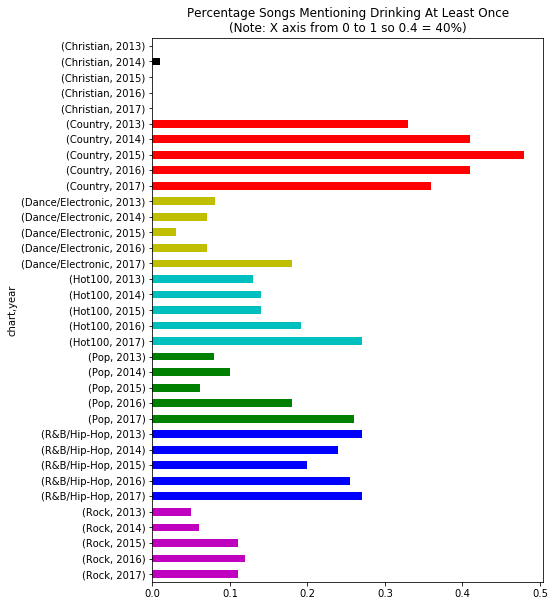

# Music By Genre Analysis

When going through a recent phase of country music I felt there were way more lyrics about drinking than normal.
I wanted to see if this was just me or if this is a measurable thing.

### Steps
- Scraped the year end Billboard charts from 2013 to 2017 for the hot100, pop, rock, country, RnB/hip-hop, Christian and dance/electronic genres. 2017 versions of the charts used below
    - https://www.billboard.com/charts/year-end/2017/hot-100-songs
    - https://www.billboard.com/charts/year-end/2017/hot-rock-songs
    - https://www.billboard.com/charts/year-end/2017/hot-country-songs
    - https://www.billboard.com/charts/year-end/2017/hot-r-and-and-b-hip-hop-songs
    - https://www.billboard.com/charts/year-end/2017/hot-dance-electronic--songs
    - https://www.billboard.com/charts/year-end/2017/pop-songs
    - https://www.billboard.com/charts/year-end/2017/hot-christian-songs
- Used Genius.com's api to get lyrics
- Found lemmas and removed stopwords in those lyrics with the nltk library
- Created a list of drinking related keywords
- Measured the percentage of songs by genre that reference drinking

### Drinking Prevalence Analysis Output
- The difference between country music's songs that reference drinking and the other charts was measured to be significant at alpha=0.05
- It can clearly be seem in the summary chart below that a lot more country music songs reference drinking in all 5 of the years examined

    

 

### ToDo
I measured the most frequently used lemmas by music genre and word type (verb, adjective, adverb, noun/all others). However it was a bit disappointing as for nearly all charts and word types the most common words are very common ones and don't show much differentiation.

This analysis in future could be improved by, instead of using simple counts, using a method that highlights the more unique words like TF-IDF.
